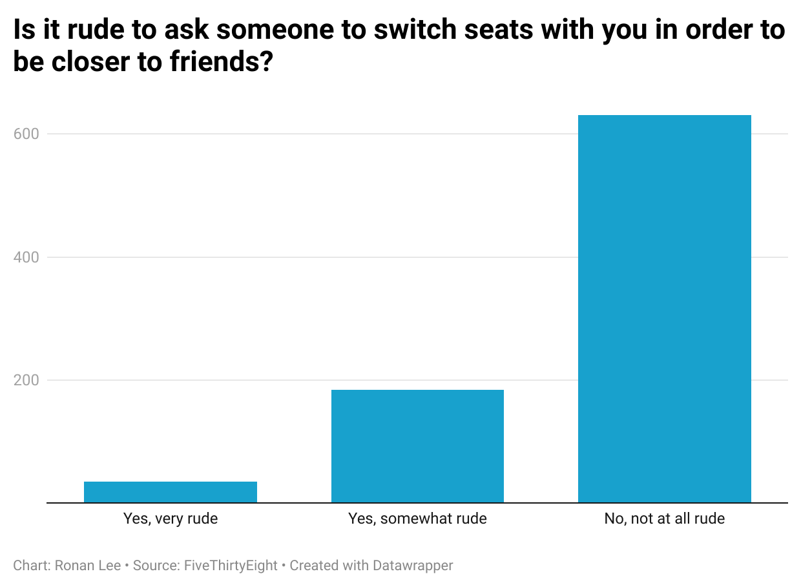

# week-4-quiz
I picked the question, *Is it rude to ask someone to switch seats with you in order to be closer to friends?* because of its relevance to me. I often travel with my family and we've had several different reactions from other airplane passengers. 
## What was interesting about this dataset
This dataset was overwhelmingly in favor of no, it is not rude at all

